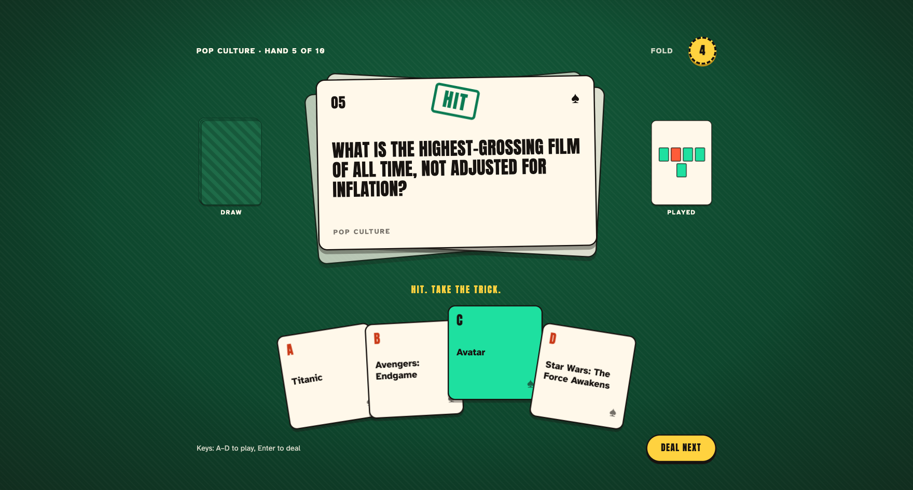

# Card Table

A single-screen trivia game played as a hand of cards on green felt: pick a deck, answer ten AI-generated questions one hand at a time, and watch the draw pile empty and the played pile fill as you go, mint for a hit, coral for a miss. Built with **Next.js 16 (App Router)**, **React 19**, **TypeScript**, and **Tailwind CSS v4**.

Questions are generated on demand with the **Vercel AI SDK** (`generateObject`) via OpenAI `gpt-4o-mini`.

**Live:** [ai-trivia-game.vercel.app](https://ai-trivia-game.vercel.app/)



## Key decisions

- **AI output is schema-checked.** A Zod schema requires exactly 10 questions with 4 choices each, and the answer must match one of the choices exactly. Malformed output is rejected before a card is dealt.
- **Slow and failed are designed states.** If a deal takes over 5 seconds, the loader says fresh questions take a moment, so it never looks frozen. If generation fails, players get a "Misdeal" card with "Deal again" or "Pick another deck". The raw server error, which can name a missing key, is logged rather than shown.
- **Playable without a mouse.** A–D or 1–4 plays a card and Enter deals the next. It respects reduced motion and targets WCAG 2.1 AA contrast.
- **One reducer owns the game.** Five phases (select, loading, error, playing, gameover). An answer locks on the first pick, so it can't be scored twice.

## Getting started

```bash
npm install

# the question API needs an OpenAI key
echo "OPENAI_API_KEY=sk-..." > .env.local

npm run dev      # http://localhost:3000
```

Without `OPENAI_API_KEY`, picking a deck shows the "Misdeal" card with "Deal again" and "Pick another deck"; the rest of the UI still runs.

## Scripts

- `npm run dev` — start the development server
- `npm run build` — production build
- `npm start` — run the production build
- `npm run lint` — lint the project

## How it plays

1. **Pick a deck:** ♣ Science & Nature, ♦ History, ♥ Geography, ♠ Pop Culture, or the **Joker** for a mix of all four.
2. **Play ten hands.** Each answer locks in, the question card is stamped HIT or MISS, and a mini-card lands on the played pile. You can **Fold** mid-round.
3. **See your hand.** Royal Flush (10/10), Full House (8+), Straight (6+), Two Pair (4+) or High Card, with your best hand saved in `localStorage`.
4. **Deal again** with the same deck, or **pick another deck**.

## Structure

- `src/app/` — App Router entry (`layout.tsx`, `page.tsx`, `globals.css`)
- `src/app/api/questions/route.ts` — AI question generation (POST `{ category }` → 10 questions)
- `src/components/` — game UI: `Trivia` (orchestrator), `FeltTable`, `CardPiles`, `ScoreChip`, `CategorySelect`, `CategoryIcon`, `TriviaQuestion`, `TriviaAnswers`, `TriviaButton`, `FinalScore`
- `src/hooks/` — `useTrivia` (game state machine), `useScoreHistory` (best-score persistence)
- `src/data/` — `categories.ts`, `types.ts`
